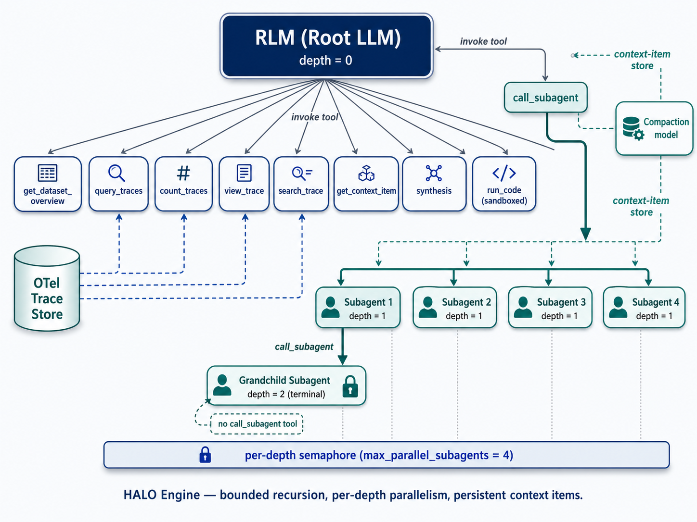
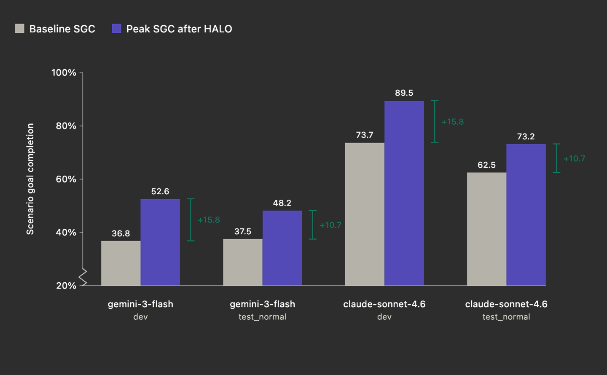

<!-- 

  <a href="https://github.com/context-labs/uwu">
    
  </a>
   
  <h1>HALO</h1>

 -->

<h1 align="center">
   
  
    
  HALO
   
</h1>

<h4 align="center">✨ RLM-based Automatic Agent Optimization Loop ✨</h4>

  
  
  

  <a href="#what-is-this">What is this?</a> •
  <a href="#why-an-rlm">Why RLM?</a> •
  <a href="#benchmarks">Benchmarks</a> •
  <a href="#contributing">Contributing</a>

## What is this?

HALO (Hierarchical Agent Loop Optimization) is a methodology for building recursively self-improving agent harnesses using [RLMs](https://github.com/alexzhang13/rlm). This repository contains information on HALO methodology, a [Python package](https://pypi.org/project/inference-catalyst-tracing/) that implements the core HALO RLM engine, and [demo projects](/demo) that show how to build HALO loops for your agents using the Python package. 

This repository also contains benchmarking examples that apply HALO to popular agent benchmarks, like [AppWorld](#appworld).

## HALO Loop

The core HALO loop is suprisingly simple:
1. Collect execution traces from your agent harness. HALO uses OpenTelemetry-compatible tracing. See [here](/demo/openai-agents-sdk-demo/) for an example using the OpenAI Agents SDK. 
2. Feed traces in the HALO RLM as a .jsonl file. We recomend starting with at least 100 traces; HALO RLM can support up to 100k traces per execution. See the [CLI Guide](/cli/README.md) for instuctions.
3. The RLM decomposes the traces to understand common failure modes and across harness executions and produces a report with it’s findings.
4. This report is then fed to a coding agent like Cursor or Claude Code, which is responsible for generating and applying a set of changes to your harness to improve performance.
5. The harness is then re-deployed, more traces are gathered, and the cycle repeats again. 

HALO is great at finding issues in production agent deployments. We find production environments tend to generate more data with higher variance across executions, creating the type of issues that HALO’s RLM-decomposition is great at spotting.

### Why an RLM?

A general-purpose harness like Claude Code is the wrong tool for trace analysis. This isn’t because the model isn’t smart, but because traces can get extremely long, and you need a specialized toolkit in order to make observations about systemic agentic behavior. We noticed in our testing that harnesses like CC would often overfit to an error present in a single/few traces rather than generalize to harness-level problems. This led us to creating a specialized form of a RLM.

## Benchmarks

HALO is consistently capable of driving improvements on benchmarks, solely by optimizing the harness. 

### AppWorld 

We applied HALO to the [AppWorld](https://appworld.dev/) benchmark, a set of agentic tasks that assess the LLM’s ability to use multi-app services like Spotify, Venmo, file systems, and phone contacts. We tested HALO’s ability to improve harnesses for both Gemini 3 Flash and Sonnet 4.6. We iterated on the harness using the `dev` split, and then used the `test_normal` split as a proxy to verify that improvements did not come from overfitting.

The feedback from HALO Engine surfaced failures in the harnesses such as hallucinated tool calls, redundant arguments in tools, refusal loops, and semantic correctness issues. Each issue mapped cleanly to a direct prompt edit. HALO’s claims were independently verified from the source trace files with the findings holding up under scrutiny. 

<!-- 
  Note: Table cell styling is still limited in GitHub Markdown rendering,
  and border-radius is not supported, but background color and padding usually work.
  If this does not display as desired, you will need to update the image asset itself
  to include padding and a black background.
-->
The peak improvements over baseline were substantial for both models. For Gemini 3 Flash, dev SGC went from 36.8% to 52.6% (+15.8 points) and test_normal SGC went from 37.5% to 48.2% (+10.7 points). For Sonnet 4.6, dev SGC went from 73.7% to 89.5% (+15.8 points) and test_normal SGC went from 62.5% to 73.2% (+10.7 points). 

## Get Started

TBD

## License

[MIT](LICENSE)

## Contributing

Contributions are welcome! Please feel free to submit a pull request.
